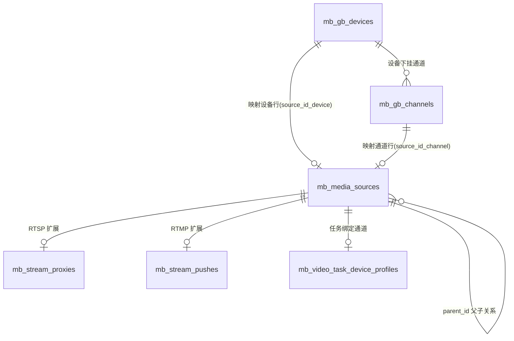

# 设备管理表设计（RTSP / RTMP / GB28181）

## 1. 文档目的

本文说明 `maas-box` 当前版本中，设备管理模块对 `RTSP`、`RTMP`、`GB28181` 三类接入源的表设计方式、字段职责、表间关系与业务约束。

结论先行：

- 项目没有为 `RTSP`、`RTMP`、`GB28181` 分别做三套独立“设备主表”。
- 当前采用的是“统一主表 + 协议扩展表 + GB 专属表”的设计。
- 统一主表是 `mb_media_sources`，前端 `/api/v1/devices` 也是围绕这张表工作。

本文依据以下实现整理：

- `internal/model/models.go`
- `internal/server/devices.go`
- `internal/server/devices_gb28181.go`
- `internal/server/gb28181_runtime.go`
- `internal/server/source_blocking.go`

## 2. 总体设计思路

### 2.1 统一主表

所有可被页面展示、预览、抓拍、任务绑定、事件关联的“媒体源”统一落在 `mb_media_sources`。

统一主表带来的好处：

- 前端设备列表只查一套数据模型。
- 任务、事件、录像、快照统一通过 `device_id = mb_media_sources.id` 关联。
- RTSP、RTMP、GB28181 通道可以共用同一套预览、抓拍、AI 任务、录制逻辑。
- GB28181 的“设备”和“通道”都能映射成统一的媒体源行，方便页面统一展示。

### 2.2 协议差异放到扩展表

协议专属字段不直接塞进主表，而是拆到扩展表：

- RTSP 拉流扩展表：`mb_stream_proxies`
- RTMP 推流扩展表：`mb_stream_pushes`
- GB28181 接入专属表：`mb_gb_devices`、`mb_gb_channels`

### 2.3 设备行与通道行分层

`mb_media_sources` 用 `row_kind` 区分两种语义：

- `device`：设备行
- `channel`：通道行

其中：

- RTSP、RTMP 当前只创建 `channel` 行
- GB28181 同时创建：
  - 设备行：表示 GB 设备本身
  - 通道行：表示设备下的可播放通道

### 2.4 关系由业务代码维护，而不是数据库外键

当前 SQLite 表结构里基本没有显式 `FOREIGN KEY` 约束，表间关系主要通过字段引用和事务同步维护：

- `mb_stream_proxies.source_id -> mb_media_sources.id`
- `mb_stream_pushes.source_id -> mb_media_sources.id`
- `mb_gb_devices.source_id_device -> mb_media_sources.id`
- `mb_gb_channels.source_id_channel -> mb_media_sources.id`
- `mb_media_sources.parent_id -> mb_media_sources.id`

这意味着：

- 优点是迁移简单、兼容 SQLite、业务可控。
- 风险是数据一致性更多依赖服务端代码而不是数据库约束。

## 3. 核心表清单

| 表名 | 作用 | 适用协议 |
| --- | --- | --- |
| `mb_media_sources` | 统一媒体源主表 | RTSP / RTMP / GB28181 |
| `mb_stream_proxies` | RTSP 拉流代理扩展 | RTSP |
| `mb_stream_pushes` | RTMP 推流扩展 | RTMP |
| `mb_gb_devices` | GB28181 设备档案与 SIP 状态 | GB28181 |
| `mb_gb_channels` | GB28181 目录通道档案 | GB28181 |
| `mb_gb_device_blocks` | GB 设备阻断表 | GB28181 |
| `mb_stream_blocks` | RTMP 流阻断表 | RTMP |
| `mb_video_task_device_profiles` | 任务绑定设备配置 | 所有可绑定通道 |

## 4. 主表 `mb_media_sources` 设计

### 4.1 表职责

`mb_media_sources` 是设备域的统一入口，负责保存：

- 媒体源基本信息
- 媒体接入类型与协议类型
- ZLM 流标识
- 在线状态、AI 状态
- 播放输出地址
- 快照地址
- 运行期录制状态

### 4.2 关键字段

| 字段 | 含义 | 说明 |
| --- | --- | --- |
| `id` | 主键 | 统一媒体源 ID，任务/事件都引用它 |
| `name` | 名称 | 前端展示名称 |
| `area_id` | 区域 ID | 归属区域 |
| `source_type` | 来源类型 | `pull` / `push` / `gb28181` |
| `row_kind` | 行类型 | `device` / `channel` |
| `parent_id` | 父级媒体源 ID | GB 通道行指向 GB 设备行；RTSP/RTMP 为空 |
| `protocol` | 协议 | `rtsp` / `rtmp` / `gb28181` |
| `transport` | 传输方式 | RTSP 常见为 `tcp/udp`；RTMP 固定 `tcp`；GB 常见 `udp/tcp` |
| `app` | ZLM App 名 | 与 `stream_id` 组成全局唯一流键 |
| `stream_id` | 流 ID | 与 `app` 组成唯一键 |
| `stream_url` | 原始流地址/业务地址 | RTSP 为原始拉流地址，RTMP 为推流地址，GB 为 `gb28181://...` |
| `status` | 媒体流状态 | 主表口径的在线/离线 |
| `ai_status` | AI 任务状态 | `idle/running/error/stopped` |
| `enable_recording` | 是否启用录制 | 当前更多是运行态投影字段 |
| `recording_mode` | 录制模式 | 当前主表保留 `none/continuous` 语义 |
| `recording_status` | 录制运行状态 | `stopped` 等 |
| `enable_alarm_clip` | 是否启用报警片段 | 运行态投影字段 |
| `alarm_pre_seconds` | 报警前录秒数 | 运行态投影字段 |
| `alarm_post_seconds` | 报警后录秒数 | 运行态投影字段 |
| `media_server_id` | 媒体服务节点 | 当前默认 `local` |
| `play_web_rtc_url` | WebRTC 播放地址 | Web 预览使用 |
| `play_wsflv_url` | WS-FLV 播放地址 | Web 预览使用 |
| `play_http_flv_url` | HTTP-FLV 播放地址 | Web 预览使用 |
| `play_hls_url` | HLS 播放地址 | Web 预览使用 |
| `play_rtsp_url` | RTSP 播放地址 | AI 输入链路优先使用 |
| `play_rtmp_url` | RTMP 播放地址 | 调试/输出使用 |
| `snapshot_url` | 快照地址 | 抓拍后写回 |
| `extra_json` | 扩展信息 | 预留字段 |
| `output_config` | 输出配置快照 | 保存各播放地址与 ZLM 相关信息 |
| `created_at` / `updated_at` | 时间戳 | 常规审计字段 |

### 4.3 主表约束

当前最重要的数据库约束有：

- 主键：`id`
- 唯一键：`(app, stream_id)`
- 索引：
  - `area_id`
  - `source_type`
  - `row_kind`
  - `parent_id`
  - `protocol`
  - `status`
  - `name`

设计意图：

- `id` 解决业务关联统一入口问题
- `(app, stream_id)` 解决 ZLM 流唯一定位问题
- `parent_id` 支持 GB 设备行与通道行的父子结构

## 5. 协议扩展表设计

### 5.1 `mb_stream_proxies`：RTSP 拉流扩展

该表只服务 `RTSP` 拉流源。

| 字段 | 含义 |
| --- | --- |
| `source_id` | 对应主表 `mb_media_sources.id` |
| `origin_url` | 原始 RTSP 地址 |
| `transport` | `tcp/udp` |
| `enable` | 是否启用代理 |
| `retry_count` | ZLM 代理重试次数 |
| `created_at` / `updated_at` | 时间戳 |

设计要点：

- RTSP 的原始接入地址放在这里，避免把代理管理细节完全耦合进主表。
- `retry_count` 会用于 ZLM `addStreamProxy`。
- 一个 RTSP 源只对应一条代理扩展记录，因此 `source_id` 是主键。

### 5.2 `mb_stream_pushes`：RTMP 推流扩展

该表只服务 `RTMP` 推流源。

| 字段 | 含义 |
| --- | --- |
| `source_id` | 对应主表 `mb_media_sources.id` |
| `publish_token` | 推流鉴权 Token |
| `last_push_at` | 最近推流时间 |
| `client_ip` | 最近推流客户端 IP |
| `created_at` / `updated_at` | 时间戳 |

设计要点：

- 主表负责“这个流是谁”，扩展表负责“这个流最近是谁在推、如何鉴权”。
- RTMP 既支持手工新增，也支持 ZLM `on_publish` 自动接入。

## 6. GB28181 专属表设计

### 6.1 `mb_gb_devices`：GB 设备档案表

这张表保存 GB 设备的接入档案与 SIP 状态，不直接替代主表。

| 字段 | 含义 | 说明 |
| --- | --- | --- |
| `device_id` | GB 设备 ID | 主键，20 位国标编码 |
| `source_id_device` | 对应设备行主表 ID | 逻辑关联到 `mb_media_sources.id` |
| `name` | 设备名称 | 可编辑 |
| `area_id` | 区域 ID | 与设备行同步 |
| `password` | 注册密码 | SIP 鉴权使用 |
| `enabled` | 是否启用 | 停用后拒绝接入 |
| `status` | SIP 状态 | `REGISTER/KEEPALIVE` 口径，不等于媒体流状态 |
| `transport` | SIP 传输方式 | `udp/tcp` |
| `source_addr` | 来源地址 | 设备注册来源 |
| `expires` | 注册过期秒数 | SIP 注册参数 |
| `last_register_at` | 最近注册时间 | 审计字段 |
| `last_keepalive_at` | 最近心跳时间 | 审计字段 |
| `created_at` / `updated_at` | 时间戳 | 审计字段 |

设计要点：

- `mb_gb_devices.status` 表示 SIP 在线，不直接表示视频流在线。
- 真正用于任务、预览、抓拍的仍然是同步出来的 `mb_media_sources` 设备行/通道行。

### 6.2 `mb_gb_channels`：GB 通道档案表

这张表保存设备目录查询得到的通道信息。

| 字段 | 含义 |
| --- | --- |
| `id` | 自增主键 |
| `device_id` | 所属 GB 设备 ID |
| `channel_id` | GB 通道 ID |
| `source_id_channel` | 对应通道行主表 ID |
| `name` | 通道名称 |
| `manufacturer` | 厂商 |
| `model` | 型号 |
| `owner` | 所有者 |
| `status` | 通道状态 |
| `raw_xml` | 目录原始 XML |
| `created_at` / `updated_at` | 时间戳 |

约束：

- 唯一键：`(device_id, channel_id)`

设计要点：

- GB 目录是设备域事实来源，通道基础资料先保存到 `mb_gb_channels`。
- 再由后台同步为 `mb_media_sources` 通道行，供统一设备页面和任务模块使用。

## 7. 阻断表设计

### 7.1 `mb_gb_device_blocks`

用于阻断已删除或手工拉黑的 GB 设备重新注册。

| 字段 | 含义 |
| --- | --- |
| `device_id` | GB 设备 ID，主键 |
| `reason` | 阻断原因 |
| `created_at` / `updated_at` | 时间戳 |

### 7.2 `mb_stream_blocks`

用于阻断已删除或手工拉黑的 RTMP 推流重新自动接入。

| 字段 | 含义 |
| --- | --- |
| `app` | ZLM App，联合主键 |
| `stream_id` | 流 ID，联合主键 |
| `reason` | 阻断原因 |
| `created_at` / `updated_at` | 时间戳 |

设计价值：

- 删除 RTMP/GB 接入源后，不会因为设备或推流端仍在线而被系统立即自动回灌。

## 8. 三类协议的落表方式

### 8.1 RTSP 拉流

落表组合：

- `mb_media_sources` 一条 `channel` 行
- `mb_stream_proxies` 一条扩展行

主表典型取值：

- `source_type = pull`
- `row_kind = channel`
- `protocol = rtsp`
- `transport = tcp/udp`
- `stream_url = 原始 RTSP 地址`
- `app + stream_id = ZLM 代理后的流标识`

扩展表典型取值：

- `source_id = 主表 id`
- `origin_url = 原始 RTSP 地址`
- `retry_count = 1`（当前默认）

### 8.2 RTMP 推流

落表组合：

- `mb_media_sources` 一条 `channel` 行
- `mb_stream_pushes` 一条扩展行

主表典型取值：

- `source_type = push`
- `row_kind = channel`
- `protocol = rtmp`
- `transport = tcp`
- `app + stream_id = 推流标识`
- `stream_url = rtmp 发布地址`

扩展表典型取值：

- `source_id = 主表 id`
- `publish_token = 鉴权 Token`
- `last_push_at / client_ip = 最近推流信息`

补充说明：

- 如果 `on_publish` 收到一个未知 RTMP 流，系统可以自动创建 `mb_media_sources + mb_stream_pushes`。
- 自动创建时默认落到根区域，名称规则为 `RTMP-<app>/<stream>`。

### 8.3 GB28181

落表组合：

- `mb_gb_devices` 一条设备档案
- `mb_gb_channels` 多条目录通道
- `mb_media_sources` 一条设备行
- `mb_media_sources` 多条通道行

设备行典型取值：

- `source_type = gb28181`
- `row_kind = device`
- `protocol = gb28181`
- `app = gb28181`
- `stream_id = <device_id>`
- `stream_url = gb28181://<device_id>`
- `parent_id = ''`

通道行典型取值：

- `source_type = gb28181`
- `row_kind = channel`
- `protocol = gb28181`
- `app = rtp`
- `stream_id = <device_id>_<channel_id>`
- `stream_url = gb28181://<device_id>/<channel_id>`
- `parent_id = 设备行的 media_source.id`

当前库里的真实示例：

- GB 设备行
  - `device_id = 34020000001110290396`
  - `source_id_device = 92d41ee7-5429-4e86-87d6-196a029eff37`
  - `mb_media_sources.stream_id = 34020000001110290396`
- GB 通道行
  - `channel_id = 34020000001310000001`
  - `source_id_channel = 9d59d69e-692b-4e0d-b8d8-6fb1737e4664`
  - `mb_media_sources.stream_id = 34020000001110290396_34020000001310000001`

## 9. 表间关系图

## 10. 与任务模块的关系

虽然任务配置不属于“设备表”本身，但设备设计里有两个很关键的约束：

### 10.1 任务绑定的是主表 `id`

任务设备配置表 `mb_video_task_device_profiles` 中：

- `device_id` 实际引用的是 `mb_media_sources.id`
- 并且当前有唯一约束：`uk_mb_video_task_device_profiles_device`

这意味着：

- 同一个通道同时只能被一个任务绑定
- 删除设备前必须先解除任务关系

### 10.2 只允许绑定 `channel` 行

任务创建时会校验：

- 设备必须存在
- `row_kind` 必须等于 `channel`

因此：

- RTSP/RTMP 可直接绑定
- GB28181 只能绑定“通道行”，不能绑定“设备行”

这也是为什么 GB 设备要拆成“设备行 + 通道行”双层模型。

## 11. 状态字段口径

这里最容易混淆，单独说明：

### 11.1 `mb_media_sources.status`

表示媒体源流状态，偏“媒体流在线/离线”口径。

适用于：

- RTSP 拉流
- RTMP 推流
- GB28181 通道媒体流

### 11.2 `mb_gb_devices.status`

表示 GB 设备 SIP 信令状态，偏“注册/心跳在线”口径。

不等价于：

- 某个通道是否已成功邀流
- 某个通道是否能播放

所以 GB 设备场景下会同时存在两层状态：

- `mb_gb_devices.status`：设备 SIP 是否在线
- `mb_media_sources.status`：设备行/通道行对应媒体流是否在线

## 12. 为什么当前设计适合这个项目

### 12.1 优点

- 统一设备列表、预览、抓拍、AI 任务、录像入口
- GB28181 可同时表达“设备管理视角”和“通道运行视角”
- RTSP/RTMP 的协议差异通过扩展表隔离，主表保持稳定
- `app + stream_id` 唯一键与 ZLM 对接自然
- 删除阻断表能解决自动接入回灌问题

### 12.2 当前代价

- 没有强外键，数据一致性依赖业务代码事务
- 主表字段偏多，承载了部分运行态字段
- 录制策略真实来源已经转到任务设备配置，主表录制字段更像运行态投影

## 13. 建议的理解口径

如果从建模角度总结，可以把当前设计理解为：

- `mb_media_sources`：统一媒体源索引表
- `mb_stream_proxies` / `mb_stream_pushes`：协议扩展表
- `mb_gb_devices` / `mb_gb_channels`：GB 接入档案表
- `mb_gb_device_blocks` / `mb_stream_blocks`：接入阻断表
- `mb_video_task_device_profiles`：设备运行策略绑定表

也就是说，项目里的“设备表”并不是单指某一张表，而是一组以 `mb_media_sources` 为核心的设备域表设计。
